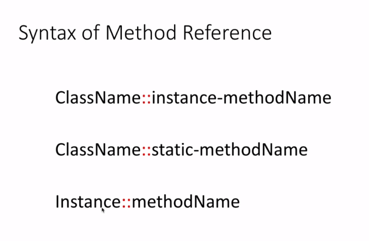
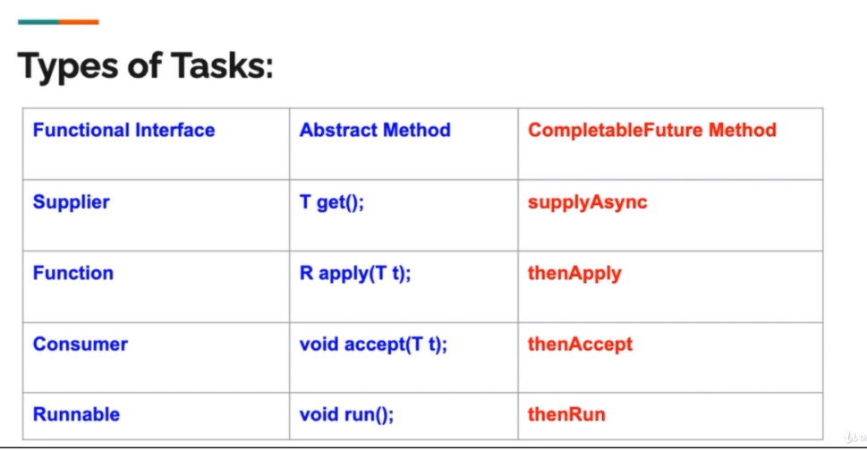

# Complete Java Masterclass

This repository contains comprehensive Java learning materials, examples, and projects covering everything from fundamentals to advanced concepts including modern Java features, frameworks, and best practices.

## 📋 Table of Contents

- [Overview](#overview)
- [Repository Structure](#repository-structure)
- [Getting Started](#getting-started)
- [Technologies Covered](#technologies-covered)
- [Project Structure](#project-structure)
- [Build Tools](#build-tools)
- [Key Features](#key-features)
- [Reference Materials](#reference-materials)

## 🎯 Overview

This repository serves as a complete Java learning resource containing:
- Core Java fundamentals and advanced concepts
- Object-Oriented Programming principles
- Modern Java features (Streams, Lambda Expressions, CompletableFuture)
- Popular frameworks (Spring Boot, Spring Security)
- Testing frameworks (JUnit, Mockito)
- Build tools (Maven, Gradle)
- Design patterns implementation
- Functional programming concepts

## 📁 Repository Structure

### Core Java Concepts
- **First_Steps/** - Basic Java syntax and fundamentals
- **Fundamentals/** - Methods, expressions, statements, and code blocks
- **Control_Flow/** - Loops, conditionals, and control structures
- **OOPS_Part1/** & **OOPS_Part2/** - Object-oriented programming concepts
- **Arrays/** - Array handling and ArrayList operations
- **Packages/** - Package organization and access modifiers

### Advanced Topics
- **Abstract_Classes_and_Interfaces/** - Abstraction and interface implementation
- **Collections/** - Java Collections Framework with practical examples
- **Generics/** - Type-safe collections and generic programming
- **Lambda_Expressions/** - Functional programming with lambdas and streams
- **Functional_Programming/** - Modern functional programming concepts
- **Regular_Expressions/** - Pattern matching and text processing

### Frameworks & Tools
- **Java_Brains/** - Spring Boot, Spring Security, and JAX-RS tutorials
- **Maven_Crash_Course/** - Maven build tool and project management
- **Design_Patterns/** - Common design patterns implementation
- **Mockito/** - Unit testing with Mockito framework
- **Modern_Java/** - Latest Java features and best practices

### Specialized Topics
- **Futures/** - Asynchronous programming with CompletableFuture
- **Debugging_and_Unit_Testing/** - Debugging techniques and testing strategies
- **wiremock-for-java-developers/** - API testing with WireMock

### Documentation
- **Notes/** - Personal learning notes and best practices
- **screenshots/** - Visual references and diagrams

## 🚀 Getting Started

### Prerequisites
- Java 11 or higher
- Maven 3.6+ or Gradle 6+
- IDE (IntelliJ IDEA, Eclipse, or VS Code)

### Setup
1. Clone the repository:
   ```bash
   git clone https://github.com/your-username/Complete-Java-Masterclass.git
   ```

2. Navigate to specific project directories and run:
   ```bash
   # For Maven projects
   mvn clean compile
   
   # For Gradle projects
   ./gradlew build
   ```

## 🛠 Technologies Covered

### Core Java
- Java SE fundamentals to advanced concepts
- Collections Framework
- Generics and Type Safety
- Exception Handling
- I/O Operations

### Modern Java Features
- Lambda Expressions
- Stream API
- CompletableFuture
- Optional Class
- Method References

### Frameworks
- **Spring Boot** - Microservices and web applications
- **Spring Security** - Authentication and authorization
- **JAX-RS** - RESTful web services
- **JUnit 4/5** - Unit testing
- **Mockito** - Mock testing

### Build Tools
- **Maven** - Dependency management and project structure
- **Gradle** - Build automation and dependency management

## 🏗 Project Structure

Each module contains:
- Source code with practical examples
- Challenge exercises and solutions
- Configuration files (pom.xml, build.gradle)
- Documentation and README files

## 🔧 Build Tools

### Maven Projects
- Located in directories with `pom.xml` files
- Run with: `mvn clean compile` or `mvn test`

### Gradle Projects  
- Located in directories with `build.gradle` files
- Run with: `./gradlew build` or `./gradlew test`

## ✨ Key Features

- **Comprehensive Coverage**: From basics to advanced enterprise-level concepts
- **Hands-on Examples**: Practical code examples for every concept
- **Challenge Exercises**: Practice problems with solutions
- **Modern Practices**: Latest Java features and industry best practices
- **Framework Integration**: Real-world framework usage examples
- **Testing Focus**: Comprehensive testing strategies and examples

## 📚 Reference Materials

### Method References


### Completable Future Methods


## 📝 Notes and Documentation

The `/Notes` directory contains valuable learning materials:
- Software engineering best practices
- Technology-specific notes and tips
- Personal development resources
- IntelliJ IDEA shortcuts and productivity tips

---

*This repository is continuously updated with new Java features, frameworks, and best practices. Feel free to explore, learn, and contribute!*
